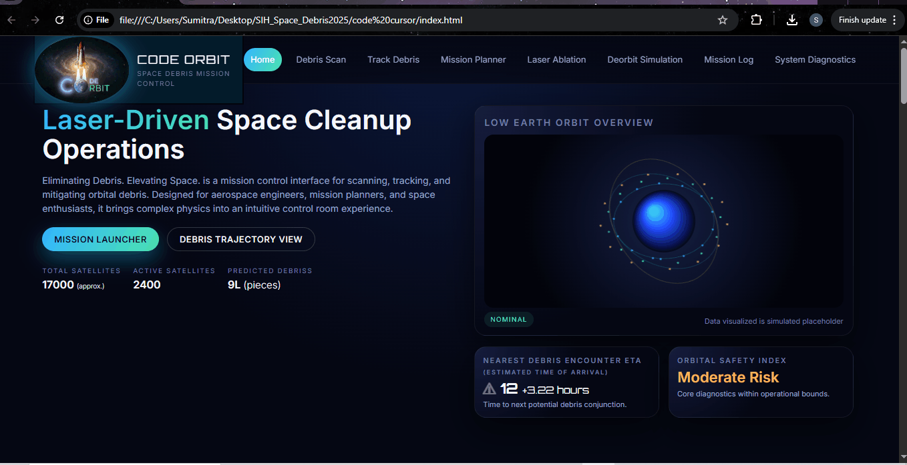

🚀 Real-Time Space Debris Detection, Tracking & Laser Deflection System
Smart India Hackathon 2025 – Space Technology Domain

This project is a complete prototype demonstrating real-time detection, tracking, and deflection of space debris using modern technologies like YOLO object detection, computer vision, orbital simulation, and Streamlit dashboards.

🛰️ Project Features
1️⃣ Real-Time Debris Detection (YOLOv8)

Detects debris and satellites using the Ultralytics YOLO model

Tracks movement using spatial distance calculations

Logs detected debris with timestamp and motion analysis

Supports live webcam or uploaded video feed

2️⃣ Real-Time Laser Deflection Simulation

A simulated representation of:

Laser tracking system on Earth

Machine-learning–based debris selection

Orbital movement of debris

Laser beam targeting & trajectory correction

Animated using matplotlib

3️⃣ Satellite Launch Visualization

A 2-phase launch animation:

Stage-1 vertical takeoff

Stage-2 orbital insertion

Final successful stable orbit

Clean visualization using FuncAnimation

4️⃣ Interactive Streamlit Dashboard

Real-time data refresh

Upload video for debris detection

Display logs, metrics, charts

Embedded animations or simulation status

📂 Project Structure
SIH_Space_Debris/
│
├── SIH_First.py # YOLO-based detection code
├── SIH_Second.py # YOLO tracking + data logging
├── SIH_Third.py # Streamlit dashboard
├── SIH_Fourth.py # Real-time laser deflection simulation
├── SIH_Fifth.py # Orbital debris visualization
├── SIH_Sixth.py # Satellite launch simulation
│
├── requirements.txt # All required Python libraries
├── README.md # Project documentation
│
└── assets/
├── sample_video.mp4 # (Optional test videos)
└── output_logs.csv

⚙️ Installation
1️⃣ Create Virtual Environment
python -m venv venv

2️⃣ Activate Environment

Windows

venv\Scripts\activate

Linux / Mac

source venv/bin/activate

3️⃣ Install Dependencies
pip install -r requirements.txt

▶️ Running the Modules
🔹 Run Streamlit Dashboard
streamlit run SIH_Third.py

🔹 Run YOLO Detection
python SIH_First.py

🔹 Run YOLO Tracking + Logging
python SIH_Second.py

🔹 Run Laser Deflection Simulation
python SIH_Fourth.py

🔹 Run Satellite Launch Animation
python SIH_Sixth.py

🧪 Technologies Used

Python

OpenCV

YOLOv8 (Ultralytics)

Matplotlib Animations

SciPy Spatial Matching

Streamlit Dashboard

Data Logging w/ Pandas

🏆 Objective

To build a futuristic model capable of:

Reducing space debris

Supporting autonomous satellite protection

Developing India’s capability in space situational awareness

## 🎥 Demo Preview

👥 Team

Smart India Hackathon – Software Edition
Team Name: Code Orbit
Members:
Sumitra Kumari
Shriyanshi Sinha
Kavita Kumari
S. Nandani
Bharti Sahu
Rea Pandey
